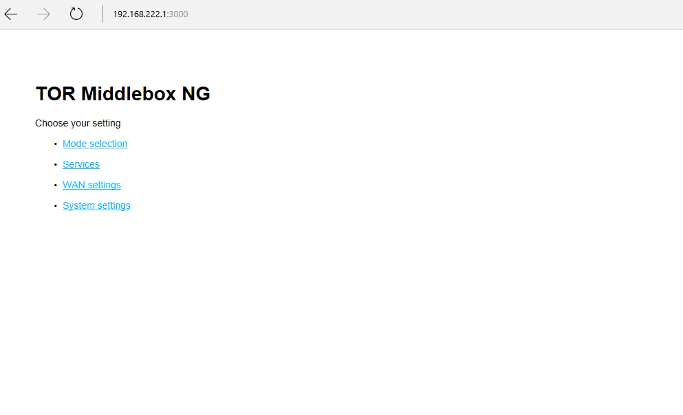
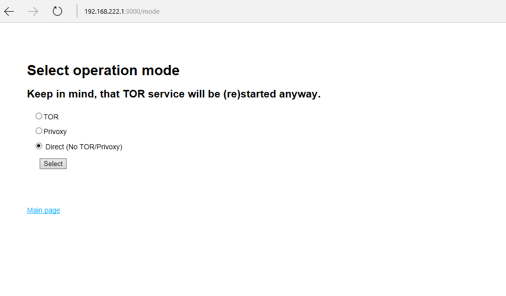
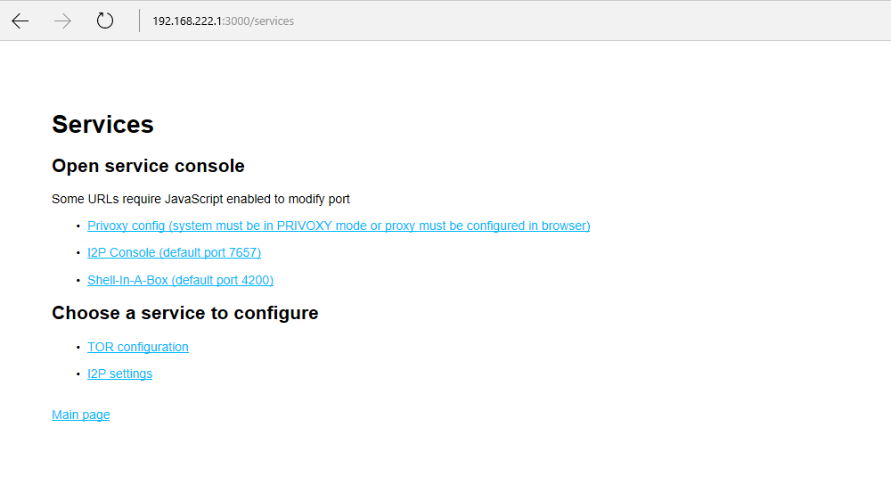
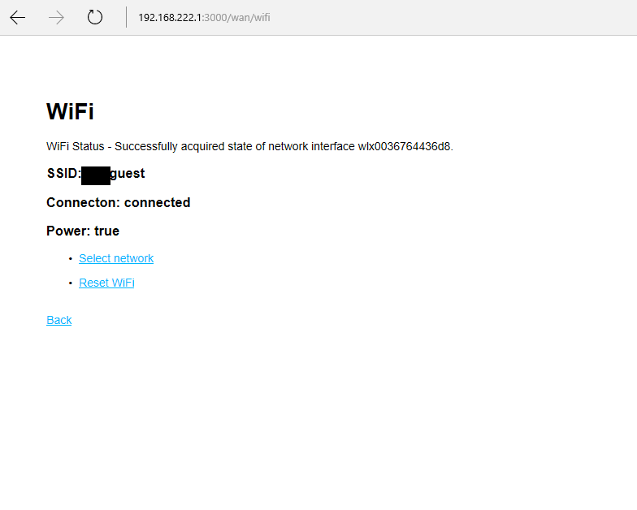
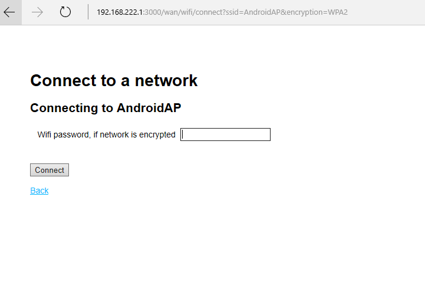
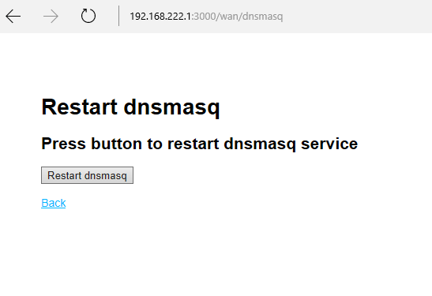
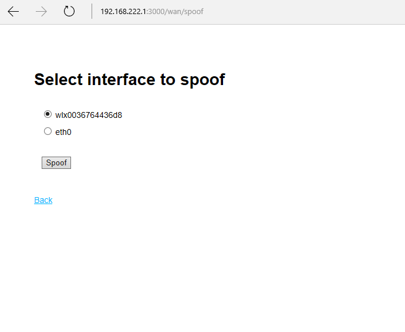
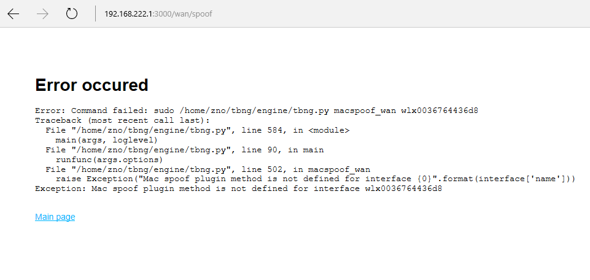
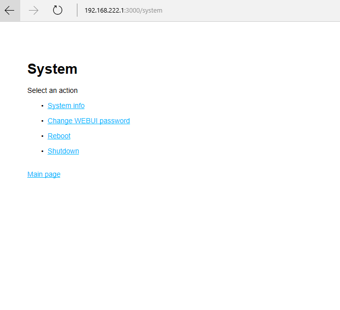

# TorBOX Next Generation

##### User Guide

## Introduction

This document describes the basic commands of the TBNG web interface, as well as the use of the command line from the terminal. A separate section describes the use of TBNG, as a proxy and access to I2P.

It is assumed, that user:

* Is familiar with TBNG overview

* Successfully finished installation and setup

* Does not have any issues with hardware

### Terms and assumptions

It is assumed, that TBNG device is available on address 192.168.222.1 just for easier understanding. Interface can be opened via [http://192.168.222.1:3000](http://192.168.222.1:3000), and for terminal access user can connect via SSH to 192.168.222.1 (port 22 by default).

## Web-interface

The Web-based TBNG is minimal, but it allows you to perform all basic commands. The general view of the interface is shown in the screenshot:



This is the main page. From it you can get into sections:

* Mode selection

* Services

* WAN settings

* System settings

### Mode selection

Here you can switch TBNG to one of three modes of operation:

* TOR — All TCP traffic is routed through the network The Onion Router

* Privoxy — all TCP traffic through TOR, http-traffic (sites) through a forced proxy server with the ability to filter — [Privoxy](http://privoxy.org)

* Direct — All traffic goes "direct" without the use of TOR and Privoxy. Fastest mode



Select the desired mode and complete the switching with the "Select" button. Remember that with *any* switching, the TOR service will be restarted on the TBNG device.

The configuration is saved between reboos. Be careful, when changing the provider, it's better to turn on Direct mode and make sure that Internet connection is still available.

### Services

From this menu, you can access services running on your device.



The first part of the menu (Open Service console) is just a shortcut for accessing services. For their proper functioning, you need a working JavaScript. In particular, when you open a new window, the URL is overwritten with the new port corresponding to the service (for example, 7657 for the I2P Console).

#### Privoxy config 

A special site [http://config.privoxy.org](http://config.privoxy.org) will be opened in new window. Here you can make changes to Privoxy configuration. In fact, it works right on the device. Before making changes, you need to read the documentation for (https://www.privoxy.org/user-manual/)[Privoxy](https://www.privoxy.org/user-manual/).

#### I2P Console

In the new window, the I2P service management console opens, if it is of course started.

#### Shell-In-A-Box

A new version of the Linux command line will be opened in the new window. That is, you can enter commands directly in the browser window. Attention! The connection will be over HTTPS, and most likely the browser will give an error that it can not verify the certificate. This is the default behavior. The user has a choice — either to ignore the error and continue, or somehow generate a new certificate. See the Shell-In-A-Box documentation for details.

The second part (Choose service to configure) is responsible for the configuration of the services. Here you can stop/restart the I2P daemon, TOR, and make changes to the TOR configuration — configure the use of TOR Bridges and block the exit nodes by country.

#### I2P Settings 


Select the action and end the selection by pressing the "Select" button.

When you restart, the I2P daemon does not start automatically. It must be started manually.

#### TOR Configuration


##### Stop/Restart TOR

A menu similar to I2P — from here you can stop or restart TOR by selecting the action and confirming it.

##### Reset configuration to default

Quite an important menu item — if it is selected and confirmed, the sections added earlier with TBNG - Bridges configuration, as well as the blocking of the output nodes - will be deleted from the TOR configuration file. Attention! This is *only* about the settings made through TBNG. If the settings are made in manual mode, they will remain unchanged (unless, of course, you have inserted them into the TBNG_autogenerated section, although it's not fair :))

TBNG makes changes to configuration files by marking these places with special comment markers and deletes them when necessary. That is, when resetting, the entire section between these markers will be deleted.

##### Configure bridge usage


TOR allows you to connect not only to published nodes, but also to so-called "bridges". This is required if the provider or company blocks the use of TOR.

TBNG supports bridge installations using the protocol **obfs3** and **obfs4**. If suddenly one of the items in the menu is missing — it means that on the device the component is found and the erroneous configuration will be slightly more complicated.

Before setting up the bridge mode, the source data must be obtained. There are several ways — through the site [https://bridges.torproject.org](https://bridges.torproject.org) or by sending an empty mail (there is a hint on the screen). Popular services are supported — gmail, yahoo and raise up.

Data about the bridge should be inserted in the field, having previously indicated the type of the bridge.

Selecting a type **none** causes the bridges to be reset.

Configuration is saved between reboots.

##### Exclude exit nodes by country

TOR can be configured to "bypass" unwanted countries. This is done in two ways — either set up a list of "desirable" countries and then it will work ONLY through these output nodes, or mark some countries as unwanted, and then the output nodes located in them will not be used. The location of the exit node is not always obvious, so that only nodes that have a clear geographic identity are subject to the rules.


Just select the "unwanted" countries and confirm the selection with the button at the end of the list. (Not fit in the screenshot).

The list of countries can be reduced in the file **_torcountry.json_**, for example, removing those countries from the existence of which you did not suspect. This will slightly reduce the list and one can manage it more comfortably.

Configuration is saved between reboots.

### WAN settings

In this section, you can set up a connection to WiFi (if you are using a wireless interface), switch to another Internet channel, and also spoof the MAC-address of the network card for Internet access, if, of course, the system supports this option.
An option to restart DNS service is available — sometimes it is required to allow correct DNS functionality after network switch/connect.


#### Select interface

WAN interface selection in TBNG.


If TBNG is configured with support for two or more network interfaces for accessing the "outside world", then at this point you can firstly see through which interface we are working at the moment, and secondly switch to the other.

Attention! Do not switch to the non-working interface. In particular, on wired, if the cable is not connected.

Selected interface is not saved during reboots. Usually, the default one will be chosen by OS (last up ?).

#### WiFi Settings

If the WAN interface is wireless, then this item should be used to connect to the WiFi network.

When selected, the connection status, the interface used, will be displayed. From here you can select an available network or reset WiFi.

The command set implemented here is not transmitted to TBNG, but to the Network Manager directly, so if something does not work, you need to see if Network Manager is functioning (as a starting point).



##### Reset WiFi

Resets the WiFi adapter to its initial state via Network Manager. After selecting this item, the action will need to be confirmed.

##### Select Network

Allows you to select a network for the connection.


Displays a list of available WiFi networks, and also shows the signal strength, channel and type of encryption. Networks are "deduplicated", that is, if several base stations with the same network are installed, one will be displayed. Hidden WiFi networks are NOT shown and connected to them using Network Manager from the command line.

Open networks, as well as networks "with a password" — WEP, WPA1/WPA2 are supported. Again, for the networks using the certificate for the connection, or for ones with the WPS engine — use the command line or the utility **_nmtui_**.

By clicking on the network name, a dialog appears where you need to enter the password (if required) and finish the connection.



Network Manager remembers the connection by default and when device is rebooted it must be restored automatically.

#### Restart dnsmasq service

Restarts dnsmasq service on device. Required to reset DNS cache. Let's consider an example — one connected to a network with a  captive portal with a hostname, which is note available in global DNS (for example, "supercofeshop.local").
After restart name should be resolved normally. It is recommended to reset cache after network switch or on initial connect after device start.



#### Spoof WAN Mac

Perhaps the most problematic point of all. Allows you to spoof the MAC-address of the network card to access the Internet at random value, __but__ it does not work everywhere and not always.



Select interface and press "Spoof" button. Spoof may work in case:

* The configuration file describes the possibility of this action

* Plugin for spoofing exists and works

* System/Kernel/Network Manager does not block this action

More details about plug-ins can be found in the "Installation and Setup Guide for TBNG".

In the event that the interface in the configuration does not have a spoof option, the following error will appear:



When the device is rebooted, the MAC address is restored to the normal value.

### System settings



Here everything is pretty obvious — you can see information about the system, change the password for the web interface, reboot the device and turn it off.

More about shutdown — if you are using a Raspberry Pi, Orange Pi, Cubieboard single-board computer, it's better to turn off the system correctly so as not to damage the media (SD card). Also, instead of shutting down the power in the Shutdown section, you can select "halt" — stop the system. This is introduced due to the fact that some single-board computers because of the core features can not shut down and go into reboot.

## Command line interface

You can manage TBNG not only from the web interface, but also from the command line. Moreover, everything that happens in the web interface is ultimately "broadcast" into the command line call, except for the commands for working with WiFi.

Running TBNG from the command line is possible only if you have sudo. Do not run TBNG from root, since in many cases the SUDO_USER variable is checked and the actions are performed under the user specified in this variable.

### Running TBNG 

```
$ sudo ./engine/tbng.py --help

usage: tbng.py [-h] [-v] command [options [options ...]]

Commands executor for TBNG project.

positional arguments:

  command    	pass command to the program - use 'help' to see available

             	options

  options    	pass command options to the program (optional)

optional arguments:

  -h, --help 	show this help message and exit

  -v, --verbose  increase output verbosity
```

When running TBNG from command line it is necessary to specify "-h", or a command and its mandatory arguments if any.

Option "-h" shows some help, option "-v" — show some debug information.

In case of a run-time error, an exception arises and a non-zero error code — so you can safely use the command in your scripts.

### TBNG commands

#### Service commands

##### help

`$ sudo ./engine/tbng.py help`

Shows available command list.
 
##### chkconfig

`$ sudo ./engine/tbng.py chkconfig`

Checks the integrity of the configuration file **_tbng.conf ._** A useful command to verify the validity of the configuration. It should be used after making changes to prevent system malfunction.

##### patch_nmcli

`$ sudo ./engine/tbng.py patch_nmcli`

Managing WiFi networks, as well as calling certain commands, requires access to Network Manager. In order to avoid problems with access to the NM, the utility nmcli is set to SUID bit, and it is executed from under root in any case. You need to run this command if the connection with WiFi has suddenly stopped working, and an update to Network Manager (which replaced the binary file nmcli) has arrived.

##### reboot, shutdown, halt

`$ sudo ./engine/tbng.py reboot`

`$ sudo ./engine/tbng.py shutdown`

`$ sudo ./engine/tbng.py halt`

Reboots, shutdowns or halts the device.

##### version

`$ sudo ./engine/tbng.py version`

Shows version information about **_tbng.py_**.

 get_cpu_temp

`$ sudo ./engine/tbng.py get_cpu_temp`

Shows CPU temperature, if

* The plug-in for reading the CPU temperature is specified in the configuration

* It exists and works

#### Networking

##### get_default_interface

`$ sudo ./engine/tbng.py get_default_interface`

Shows current network interface, used for Internet access.

##### set_default_interface

`$ sudo ./engine/tbng.py set_default_interface INTERFACE_NAME`

Sets a network interface for accessing the Internet. The command argument is the name of the interface. During execution, all interfaces will be stopped and only one specified will be started.

##### clean_firewall

`$ sudo ./engine/tbng.py clean_firewall`

Clears iptables rules. The command is used infrequently, but is sometimes needed for diagnosis and verification. Attention! When you call any of the modes — TOR, Privoxy, Direct — iptables rules will be applied again.

##### masquerade

`$ sudo ./engine/tbng.py masquerade`

Enables IP Masquerade, also known as NAT on the network interfaces described in the configuration. The command is again needed for debugging and is usually used in conjunction with __clean_firewall__. E.g clean iptables, enable masquerading. If the interfaces are described correctly, then the clients connected to TBNG get access to the Internet.

##### macspoof_wan

`$ sudo ./engine/tbng.py macspoof_wan INTERFACE_NAME`

Tries to spoof the MAC-address of the specified network card. It does this via the plugin and only if this action is allowed in the configuration file.

#### Services

##### tor_restart, tor_stop

`$ sudo ./engine/tbng.py tor_restart`

`$ sudo ./engine/tbng.py tor_stop`

Restarts or stops TOR.

##### i2p_restart, i2p_stop

`$ sudo ./engine/tbng.py i2p_restart`

`$ sudo ./engine/tbng.py i2p_stop`

Restarts or stops I2P.

##### tor_reset

`$ sudo ./engine/tbng.py tor_reset`

Removes TOR settings made through TBNG for bridges and excluded exit nodes.

##### probe_obfs

`$ sudo ./engine/tbng.py probe_obfs`

Searches for binary files in the system, necessary for obfs proxy operation — obfs4 and obfs3. Returns a JSON string, which lists the possible options. It is used mainly from the web interface to give the user the options.

##### tor_bridge

`$ sudo ./engine/tbng.py tor_bridge '{....}'`

Sets the mode of using TOR Bridges. As a parameter, you need to pass a JSON string with information about bridges. This is quite a laborious task, and it is implied that the command will be executed from the web-interface, where it is generated programmatically.

An example with distorted bridge values is a JSON object of two fields — a mode and an array of strings with data from bridges:

`$ sudo tbng/engine/tbng.py tor_bridge '{"mode": "obfs4", "bridges": ["obfs4 34.34.34.34:9443 4AA73BBBB1903E2311BE8D8C91470656F52D63F8 cert=TIsFNHYKUkkzj+LGhv8NtR/4OSMFz9RBtcu6/zeWddlReQqYsBd3QssVQB35muHkMtelQw iat-mode=0", "obfs4 52.53.54.55:9443 358BE10583048D80D0229B31ADF1A36B0AAAAAA cert=IVBWeCfe9f9jpqN9i9BTo6Aq/+l+56HEwF/YUvRuAAADdJXfGDNjHWvpjRwOlLPLdbbYYw iat-mode=0", "obfs4 231.231.231.231:80 B687A4B74920A7842B676C0C300D7119FB5F7E24 cert=zFJYOZ3hYHN9i9CcYAkbUt1bHG2ZFahEppklUNpP04NSmiGY1IlrUiIMYK3N28Xmn5G7UA iat-mode=0"]}'`

##### tor_exclude_exit

`$ sudo ./engine/tbng.py tor_exclude_exit '["code1","code2"]'`

Blocks TOR exit nodes in the specified countries. As a parameter, you need to pass the JSON string with the information countries (array). Again, this is quite a laborious task, and it is implied that the command will be executed from the web interface, where it is generated programmatically.

Working example:

`$ sudo ./engine/tbng.py tor_exclude_exit '["ac","af"]'`

Blocks countries with codes "ac" and "af".

##### dnsmasq_restart

Restarts dnsmasq. Needed, when WAN is switched to another network and sometimes on first start. Cleans DNS cache.

`$ sudo ./engine/tbng.py dnsmasq_restart`

#### Mode switching

##### mode

`$ sudo ./engine/tbng.py tor`

`$ sudo ./engine/tbng.py privoxy`

`$ sudo ./engine/tbng.py direct`

`$ sudo ./engine/tbng.py restore`

Actually, switching mode. The first three options set the mode, but the last one restores the mode from the runtime.json file and is usually executed at system startup when parameters are restored.

## Using TBNG services

TBNG allows you to use not only TOR and Privoxy, but also access sites located on the I2P network.

However, for I2P there are restrictions — you can open them only from the browser that has a proxy server that points to the TBNG address.

### I2P Access

In order to access the I2P network via TBNG, you need to configure the browser to use the http proxy — set the address of device with TBNG.

Mozilla Firefox example:


When opening an I2P site, the request will go to Privoxy, running on the device with TBNG. Privoxy determines that the request should be forwarded to the I2P daemon. Attention! I2P must be up and running (this usually takes some time to start and settle).

### Working with Proxy server in Direct mode

Also, you can use TOR / Privoxy in Direct mode only in separate applications.

To use HTTP Proxy, use the value **_aa.bb.cc.dd:8118_** (e.g. 192.168.222.1:8118).

To use Socks5 Proxy, use the value **_aa.bb.cc.dd:9050_** (e.g. 192.168.222.1:9050).

In the first case, the role of HTTP Proxy is performed by Privoxy running on the device with TBNG, in the second case the role of Socks5 Proxy is TOR itself.

