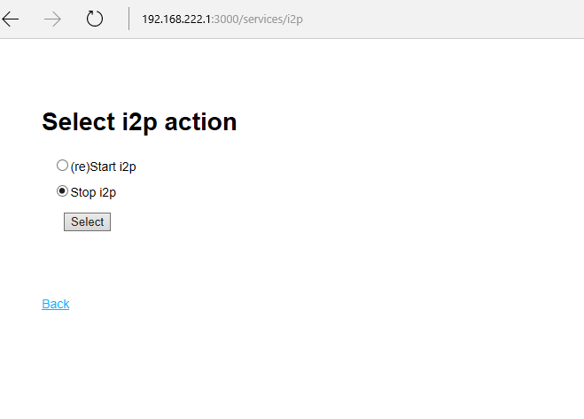
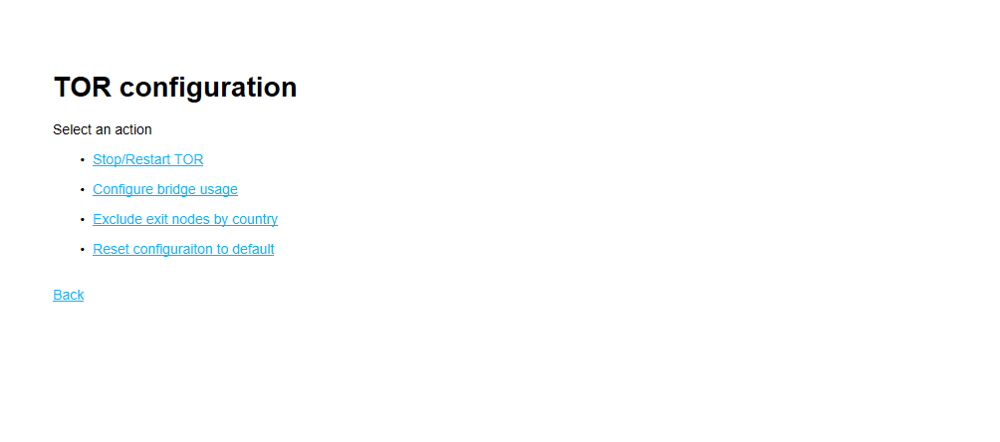
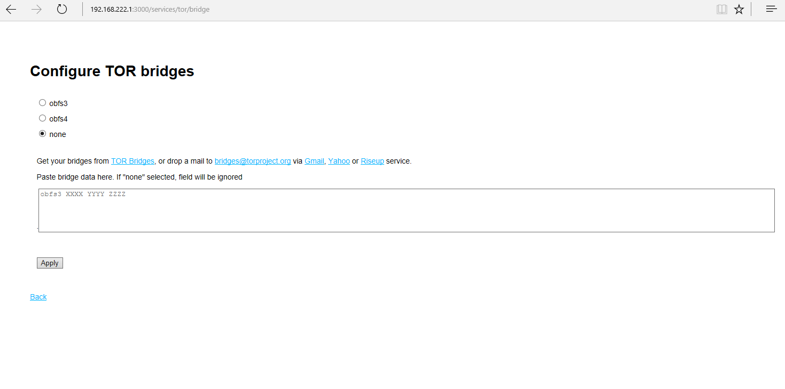
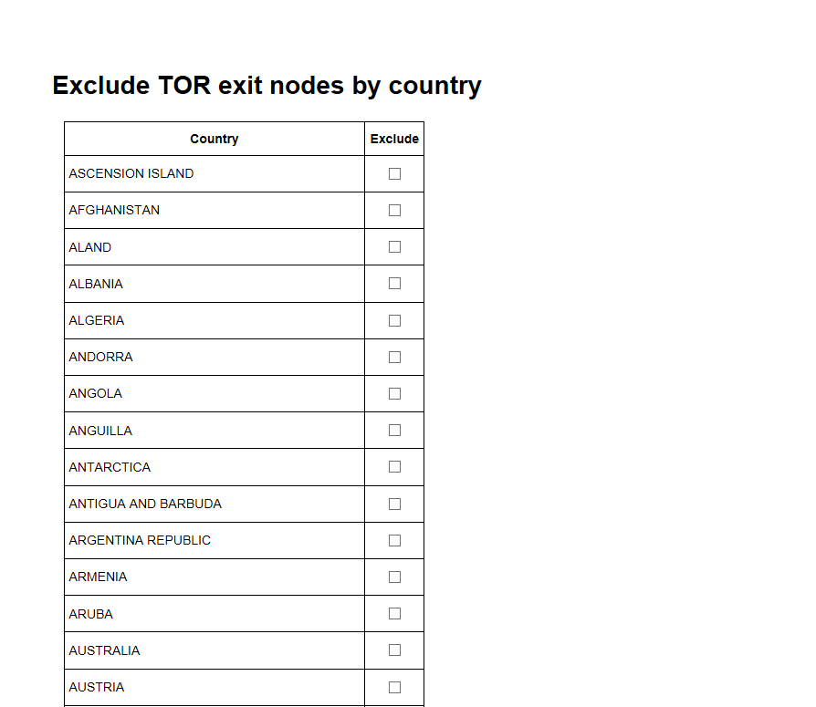
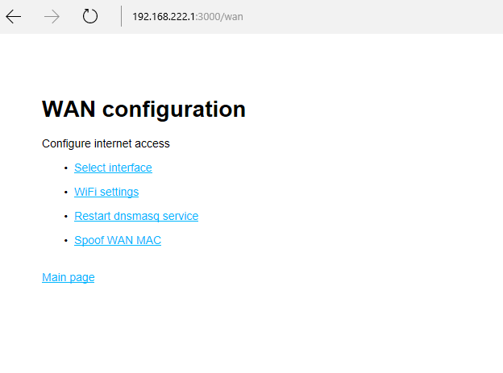
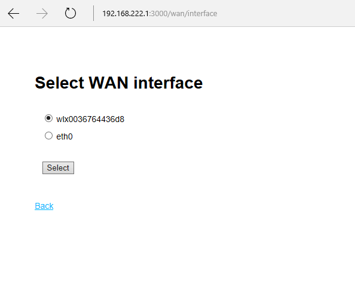
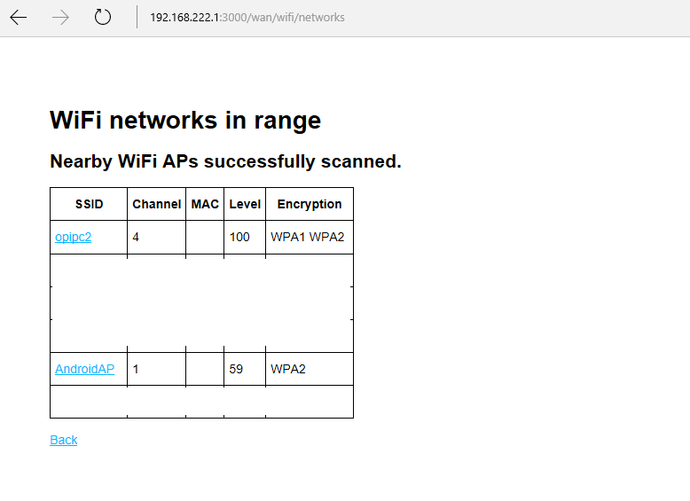
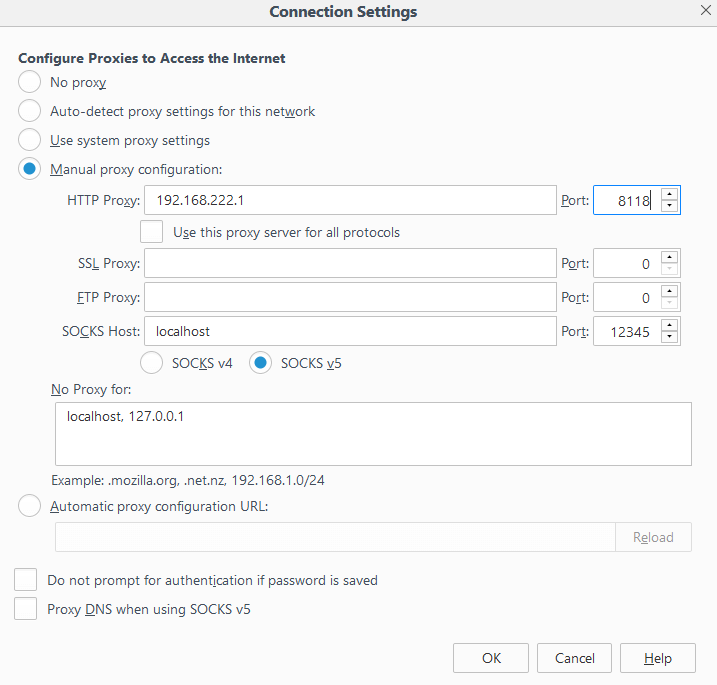

# TorBOX Next Generation

##### Руководство Пользователя

## Введение

В этом документе описаны основные команды web-интерфейса TBNG, а также использование командной строки из терминала. Отдельным разделом описано использование TBNG, как proxy и доступ к I2P.

Подразумевается, что пользователь:

* Ознакомлен с общим описанием проекта

* Успешно провёл установку и первичную настройку

* Не имеет проблем с оборудованием

### Общие положения

Будем считать, что устройство с TBNG доступно по адресу 192.168.222.1 для определенности. Соотвественно, web-интерфейс открывается по адресу [http://192.168.222.1:3000](http://192.168.222.1:3000), а для терминального доступа пользователь может соединиться по SSH с адресом 192.168.222.1 (порт 22 по умолчанию).

## Web-интерфейс

Web-интейрфес TBNG минималистичен, однако позволяет выполнить все базовые команды. Общий вид интерфейса показан на скриншоте:


Это главная страница. Из неё можно попасть в разделы:

* Выбор режимов работы (Mode selection)

* Управление сервисами (Services)

* Настройки доступа в Интернет (WAN settings)

* Настройки системы (System settings)

### Mode selection

Здесь можно переключить TBNG в один из трёх предусмотренных режимов работы:

* TOR — весь TCP трафик направляется через сеть The Onion Router

* Privoxy — весь TCP трафик через TOR, http-трафик (сайты) через принудительный прокси-сервер с возможностью фильтрации — [Privoxy](http://privoxy.org)

* Direct — Весь трафик идёт "на прямую" без использования TOR и Privoxy. Самый быстрый режим


Выберите нужный режим и завершите переключение с помощью кнопки "Select". Помните, что при *любом *переключении сервис TOR будет перезапущен на устройстве с TBNG.

Конфигурация сохраняется после перезагрузки. Будьте внимательны, при смене провайдера лучше включить режим Direct и убедиться, что "Интернет есть".

### Services

Из этого меню можно получить доступ к сервисам, работающим на устройстве.


Первая часть меню (Open Service console) — это просто ярлыки для доступа к сервисам. Для их корректного функционирования нужен работающий JavaScript. В частности при открытии нового окна происходит перезапись URL с новым портом, соответствующем сервису (например, 7657 для I2P Console).

#### Privoxy config 

В новом окне откроется служебный сайт [http://config.privoxy.org](http://config.privoxy.org),  где можно внести изменения в работу Privoxy. На самом деле он работает прямо на устройстве. Прежде чем вносить изменения, необходимо почитать документацию на [Privoxy](https://www.privoxy.org/user-manual/).

#### I2P Console

В новом окне откроется консоль управления сервисом I2P, если он конечно запущен.

#### Shell-In-A-Box

В новом откроется веб-версия командной строки Linux. То есть команды можно вводить прямо в окне браузера. Внимание! Соединение будет по протоколу HTTPS, и скорее всего браузер выдаст ошибку о том, что не может проверить сертификат. Это поведение по-умолчанию. У пользователя есть выбор — либо игнорировать ошибку и продолжить, либо каким-то образом сгенерировать новый сертификат. Подробности можно узнать в документации Shell-In-A-Box.

Вторая часть  (Choose service to configure) отвечает за конфигурацию сервисов. Здесь можно остановить/перезапустить демона I2P, TOR, а также внести изменения в конфигурацию TOR — настроить использование TOR Bridges и заблокировать выходные узлы по странам.

#### I2P Settings 



Выберите действие и завершите выбор нажатием кнопки "Select". 

При перезагрузке демон I2P не стартует автоматически. Его нужно запускать вручную.

#### TOR Configuration



##### Stop/Restart TOR

Меню, аналогичное I2P — отсюда можно остановить или перезапустить TOR выбрав действие и подтвердив его.

##### Reset configuration to default

Довольно важный пункт меню — если он выбран и подтвержден, то из файла конфигурации TOR будут удалены секции, добавленные ранее с помощью TBNG — настройка Bridges, а также настройка блокировки выходных узлов. Внимание! Речь идёт *только *о настройках, сделанных через TBNG. Если настройки внесены в ручном режиме — они останутся без изменений (если, конечно вы не внесли их внутрь секции TBNG_autogenerated, хотя это и нечестно :)) 

TBNG вносит изменения в файлы конфигураций, помечая эти места специальными маркерами-комментариями и удаляет их, когда необходимо. То есть при сбросе удалится вся секция между этими маркерами.

##### Configure bridge usage



TOR  позволяет соединяться не только с опубликованными узлами, но и с так называемыми "мостами". Это требуется, если провайдер или компания блокируют использование TOR.

TBNG поддерживает установки мостов по протоколу **obfs3** и **obfs4**. Если вдруг какого-то из пунктов в меню не хватает — это значит, что на устройстве на найден компонент и установить ошибочную конфигурацию будет несколько сложнее.

Перед установкой режима моста исходные данные нужно получить. Есть несколько способов — через сайт [https://bridges.torproject.org](https://bridges.torproject.org) или через посылание пустого письма (подсказка есть на экране). Поддержаны популярные сервисы — gmail, yahoo и raise up.

Данные о мосте нужно вставить в поле, предварительно указав тип моста.

Выбор типа **none** приводит к сбросу настроек мостов.

Конфигурация сохраняется после перезагрузки.

##### Exclude exit nodes by country

TOR можно настроить для "обхода" нежелательных стран. Это делается двумя способами — либо настроить список "желательных" стран и тогда он будет работать ТОЛЬКО через эти выходные узлы, либо пометить некоторые страны, как нежелательные, и тогда выходные узлы, расположенные в них использоваться не будут. Местонахождение выходного узла не всегда очевидно, так что правилам подчиняются только узлы, имеющие чёткую географическую принадлежность.



Просто выберите "нежелательные" страны и подтвердите выбор кнопкой в конце списка. (Не поместилась на  скриншот).

Список стран можно уменьшить в файле **_torcountry.json_**, например удалив оттуда те страны, о существовании которых вы не подозревали. Это немного уменьшит список и ориентироваться в нём будет легче. 

Конфигурация сохраняется после перезагрузки.

### WAN settings

В этом разделе можно настроить подключение к WiFi (в случае, если используется беспроводной интерфейс), переключиться на другой интернет-канал, а также подменить mac-адрес сетевой карты для доступа в Интернет, если, конечно система поддерживает такую возможность.



#### Select interface

Выбор интерфейса WAN. 



Если TBNG настроена с поддержкой двух и более сетевых интерфейсов для доступа "во внешний мир", то в этом пункте можно во-первых посмотреть, через какой интерфейс мы работаем в данный момент, а во-вторых переключиться на другой.

Внимание! Не стоит переключаться на неработающий интерфейс. В частности на проводной, если кабель не подключен.

Выбранный интерфейс не запоминается и при перезагрузке дефолтным будет тот, который выберет сама система (как правило, последний из "поднявшихся").

#### WiFi Settings

Если WAN интерфейс беспроводной, то именно этот пункт нужно использовать для соединения с сетью WiFi.

При выборе будет показан статус соединения, использованный интерфейс. Отсюда же можно выбрать доступную сеть или сбросить WiFi.

Набор команд, реализуемый здесь передается не TBNG, а Network Manager напрямую, поэтому если что-то не работает, нужно смотреть, функционирует ли Network Manager (для начала).


##### Reset WiFi

Сбрасывает WiFi адаптер в начальное состояние через Network Manager. После выбора этого пункта действие нужно будет подтвердить.

##### Select Network

Позволяет выбрать сеть для соединения.



Выводит список доступных сетей WiFi, а также показывает уровень сигнала, канал и тип шифрования. Сети "дедуплицируются", то есть если установлено несколько базовых станций с одной и той же сетью, будет показана одна. Скрытые WiFi сети НЕ показываются и соединяться с ними нужно с использованием Network Manager из командной строки.

Поддержаны открытые сети, а также сети "с паролем" — WEP, WPA1/WPA2. Опять-таки, сети использующие сертификат для соединения, механизм WPS — используйте командную строку или утилиту **_nmtui_**.

По клику на имя сети возникает диалог, где нужно ввести пароль (если требуется) и завершить соединение.


Network Manager по умолчанию запоминает соединение и при перезагрузке устройства оно должно быть восстановлено автоматически.

#### Spoof WAN Mac

Пожалуй, самый проблемный пункт из всех. Позволяет сменить mac-адрес сетевой карты для доступа к Интернет на случайный, НО работает не везде и не всегда.


Выбираем интерфейс и жмём кнопку "Spoof". Подмена произойдет только в указанных случаях:

* В конфигурационном файле описана возможность этого действия

* Плагин для подмены есть и работает

* Система/Ядро/Network Manager  не возражают

Более подробно о плагинах можно почитать в "Руководстве по установке и настройке TBNG".

В случае, если интерфейс в конфигурации не имеет опции spoof, появится такая ошибка:


При перезагрузке устройства MAC-адрес восстанавливается в обычное значение.

### System settings


Тут всё довольно очевидно — можно посмотреть информацию о системе, изменить пароль для web-интерфейса, перезагрузить устройство и выключть.

Подробнее о выключении — если используется одноплатный компьютер Raspberry Pi, Orange Pi, Cubieboard — систему лучше выключать корректно, чтобы не испортить носитель (SD-карту). Также вместо отключения питания в разделе Shutdown можно выбрать "halt" — остановка системы. Это введено из-за того, что некоторые одноплатные компьютеры из-за особенностей ядра не могут выключиться и уходят в перезагрузку.

## Интерфейс командной строки

Управлять TBNG можно не только из web-интерфейса, но и с помощью командной строки. Более того, всё, что происходит в web-интерфейсе в конечном итоге "транслируется" в вызов командной строки за исключением команд работы с WiFi.

Запуск TBNG из командной строки возможен только при наличии sudo. Не следует запускать TBNG из-под root, так как во многих случаях проверяется переменная SUDO_USER и действия выполняются под пользователем, указанном в этой переменной. 

### Вызов TBNG

```
$ sudo ./engine/tbng.py --help

usage: tbng.py [-h] [-v] command [options [options ...]]

Commands executor for TBNG project.

positional arguments:

  command    	pass command to the program - use 'help' to see available

             	options

  options    	pass command options to the program (optional)

optional arguments:

  -h, --help 	show this help message and exit

  -v, --verbose  increase output verbosity
```

При вызове нужно указать либо -h, либо команду и её обязательные аргументы, если есть.

Опция -h выдаст подсказку, опция -v — покажет отладочную информацию.

В случае ошибки выполнения возникает exception и ненулевой код ошибки — так что можно смело использовать команду в своих скриптах.

### Команды TBNG

#### Сервисные команды

##### help

`$ sudo ./engine/tbng.py help`

Показывает список доступных команд.
 
##### chkconfig

`$ sudo ./engine/tbng.py chkconfig`

Проверяет целостность конфигурационного файла **_tbng.conf._** Полезная команда для проверки валидности конфигурации. Нужно использовать после внесения изменений, чтобы не привести систему в нерабочее состояние.

##### patch_nmcli

`$ sudo ./engine/tbng.py patch_nmcli`

Управление WiFi-сетями, а также вызов некоторых команд требует обращения к Network Manager. Для того, чтобы исключить проблемы с доступом к NM, на утилиту nmcli выставляется SUID bit, и она выполняется из-под root в любом случае. Запускать эту команду нужно, если вдруг перестало работать соединение с WiFi, а также пришло обновление на Network Manager (которое заменило нам бинарный файл nmcli).

##### reboot, shutdown, halt

`$ sudo ./engine/tbng.py reboot`

`$ sudo ./engine/tbng.py shutdown`

`$ sudo ./engine/tbng.py halt`

Перегружает, выключает или останавливает устройство соответственно.

##### version

`$ sudo ./engine/tbng.py version`

Показывает информацию о версии **_tbng.py_**.

get_cpu_temp

`$ sudo ./engine/tbng.py get_cpu_temp`

Показывает температуру процессора, если:

* Плагин для чтения температуры процессора указан в конфигурации

* Он есть и работает

#### Работа с сетью

##### get_default_interface

`$ sudo ./engine/tbng.py get_default_interface`

Показывает текущий сетевой интерфейс, используемый для доступа к Интернет.

##### set_default_interface

`$ sudo ./engine/tbng.py set_default_interface INTERFACE_NAME`

Устанавливает сетевой интерфейс для доступа к Интернет. Аргумент команды — имя интерфейса. В процессе выполнения будут остановлены все интерфейсы и запущен только один указанный.

##### clean_firewall

`$ sudo ./engine/tbng.py clean_firewall`

Очищает правила iptables. Команда используется нечасто, но бывает нужна для диагностики и проверки. Внимание! При вызове какого либо из режимов — TOR, Privoxy, Direct — правила iptables опять будут применены.

##### masquerade

`$ sudo ./engine/tbng.py masquerade`

Включает IP Masquerade, также известный как NAT на сетевых интерфейcах, описанных в конфигурации. Команда нужна опять-таки для отладки и обычно используется совместно с clean_firewall. Т.е. чистим iptables, включаем masquerading. Если интерфейсы описаны правильно, то клиенты, подключенные к TBNG получают доступ в Интернет.

##### macspoof_wan

`$ sudo ./engine/tbng.py macspoof_wan INTERFACE_NAME`

Пытается подменить mac-адрес указанной сетевой карты. Делает это через плагин и только в том случае, если в конфигурационном файле разрешено это действие.

#### Работа с сервисами

##### tor_restart, tor_stop

`$ sudo ./engine/tbng.py tor_restart`

`$ sudo ./engine/tbng.py tor_stop`

Перезапускает или останавливает TOR.

##### i2p_restart, i2p_stop

`$ sudo ./engine/tbng.py i2p_restart`

`$ sudo ./engine/tbng.py i2p_stop`

Перезапускает или останавливает I2P.

##### tor_reset

`$ sudo ./engine/tbng.py tor_reset`

Убирает настройки TOR, сделанные через TBNG для bridges и исключенных exit nodes. 

##### probe_obfs

`$ sudo ./engine/tbng.py probe_obfs`

Ищет в системе бинарные файлы, нужные для обеспечения работы obfs proxy — obfs4 и obfs3. Возвращает JSON-строку, где перечислены возможные опции. Используется в основном из web-интерфейса для выдачи пользователю возможных вариантов.

##### tor_bridge

`$ sudo ./engine/tbng.py tor_bridge '{....}'`

Устанавливает режим использования TOR Bridges. В качестве параметра нужно передавать строку JSON с информацией о мостах. Это довольно трудоемкое дело, и подразумевается, что команда будет выполняться из web-интерфейса, где формируется программно.

Пример с искаженными значениями мостов — JSON-объект из двух полей — режим и массив строк с данными мостов:

`$ sudo tbng/engine/tbng.py tor_bridge '{"mode": "obfs4", "bridges": ["obfs4 34.34.34.34:9443 4AA73BBBB1903E2311BE8D8C91470656F52D63F8 cert=TIsFNHYKUkkzj+LGhv8NtR/4OSMFz9RBtcu6/zeWddlReQqYsBd3QssVQB35muHkMtelQw iat-mode=0", "obfs4 52.53.54.55:9443 358BE10583048D80D0229B31ADF1A36B0AAAAAA cert=IVBWeCfe9f9jpqN9i9BTo6Aq/+l+56HEwF/YUvRuAAADdJXfGDNjHWvpjRwOlLPLdbbYYw iat-mode=0", "obfs4 231.231.231.231:80 B687A4B74920A7842B676C0C300D7119FB5F7E24 cert=zFJYOZ3hYHN9i9CcYAkbUt1bHG2ZFahEppklUNpP04NSmiGY1IlrUiIMYK3N28Xmn5G7UA iat-mode=0"]}'`

##### tor_exclude_exit

`$ sudo ./engine/tbng.py tor_exclude_exit '["code1","code2"]'`

Блокирует TOR exit nodes в указанных странах . В качестве параметра нужно передавать строку JSON с информацией странах (массив). Опять-таки это довольно трудоемкое дело, и подразумевается, что команда будет выполняться из web-интерфейса, где формируется программно.

Работающий пример:

`$ sudo ./engine/tbng.py tor_exclude_exit '["ac","af"]'`

Блокирует страны с кодами "ac" и "af".

#### Переключение режимов

##### mode

`$ sudo ./engine/tbng.py tor`

`$ sudo ./engine/tbng.py privoxy`

`$ sudo ./engine/tbng.py direct`

`$ sudo ./engine/tbng.py restore`

Собственно, переключение режима. Первые три варианта выставляют режим, а вот последний — восстанавливает режим из файла runtime.json и обычно выполняется на старте системы при восстановлении параметров.

## Использование сервисов TBNG

TBNG позволяет использовать не только TOR и Privoxy, но и получать доступ к сайтам, расположенным в сети I2P. 

Правда, для I2P есть ограничения — открывать их можно только из браузера у которого настроен proxy-сервер, указывающий на адрес TBNG.

### Доступ к сети I2P

Для того, чтобы получить доступ к сети I2P через TBNG, нужно настроить браузер для использования http proxy, который, в свою очередь работает на устройстве с TBNG.

Вот пример настройки Mozilla Firefox:



При открытии I2P сайта запрос уйдет на Privoxy, работающий на устройстве с TBNG. Privoxy определит, что запрос нужно перенаправить I2P-демону. Внимание! I2P должен быть запущен и готов к работе (это, как правило, занимает некоторое время).

### Работа с Proxy server в режиме Direct

Также можно находясь в режиме Direct использовать TOR/Privoxy только в отдельных приложениях.

Для использования HTTP Proxy используйте значение **_aa.bb.cc.dd:8118_** (например 192.168.222.1:8118).

Для использования Socks5 Proxy используйте значение **_aa.bb.cc.dd:9050_** (например 192.168.222.1:9050).

В первом случае роль HTTP Proxy  выполняет Privoxy, работающий на устройстве с TBNG, во втором случае роль Socks5 Proxy — сам TOR.

